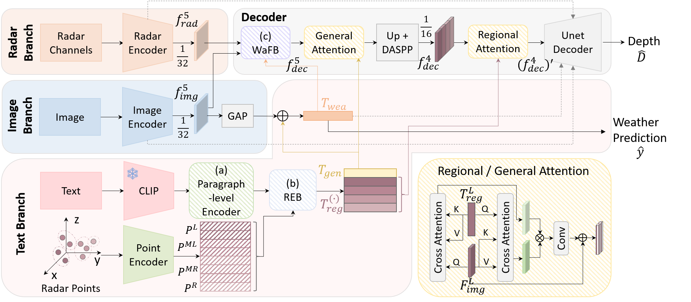

# TRIDE
Pytorch implementation of TRIDE: A Text-assisted Radar-Image weather-aware fusion network for Depth Estimation (Accepted by TMLR)

Paper link: https://arxiv.org/abs/2508.08038

Models have been tested using Python 3.7/3.8, Pytorch 1.10.1+cu111

## Abstract
Depth estimation, essential for autonomous driving, seeks to interpret the 3D environment surrounding vehicles. The development of radar sensors, known for their cost-efficiency and robustness, has spurred interest in radar-camera fusion-based solutions. However, existing algorithms fuse features from these modalities without accounting for weather conditions, despite radars being known to be more robust than cameras under adverse weather. Additionally, while Vision-Language models have seen rapid advancement, utilizing language descriptions alongside other modalities for depth estimation remains an open challenge. This paper first introduces a text-generation strategy along with feature extraction and fusion techniques that can assist monocular depth estimation pipelines, leading to improved accuracy across different algorithms on the KITTI dataset. Building on this, we propose TRIDE, a radar-camera fusion algorithm that enhances text feature extraction by incorporating radar point information. To address the impact of weather on sensor performance, we introduce a weather-aware fusion block that adaptively adjusts radar weighting based on current weather conditions. Our method, benchmarked on the nuScenes dataset, demonstrates performance gains over the state-of-the-art, achieving a 12.87% improvement in MAE and a 9.08% improvement in RMSE.



## Setting up dataset
To prepare the dataset, follow the data preparation guide in the [CaFNet repo](https://github.com/harborsarah/CaFNet). Install dependencies using the provided "requirements.txt". If you only intend to train and evaluate this model, any PyTorch version is acceptable.

After generating the dataset, the folder structure should look like:

```
├── data/
    ├── nuscenes_derived/
        ├── ground_truth/
        ├── radar_points_new/
        ...
    ├── nuscenes_derived_test/
        ├── ground_truth/
        ├── radar_points_new/
        ...
├── training/
    ├── nuscenes/
        ├── nuscenes_train_ground_truth.txt
        ├── nuscenes_train_radar_new.txt
        ...
├── validation/
    ├── nuscenes/
        ├── nuscenes_val_ground_truth.txt
        ├── nuscenes_val_radar_new.txt
        ...
├── testing/
    ├── nuscenes/
        ├── nuscenes_test_ground_truth.txt
        ├── nuscenes_test_radar_new.txt
        ...
```

- The pre-encoded paragraph text features required for training and evaluation are packaged in nuscenes_derived_1.zip, nuscenes_derived_2.zip, and nuscenes_derived_test.zip.
Unzip it and copy the extracted contents into data/nuscenes_derived and data/nuscenes_derived_test/ (merge with existing files if prompted).
- We also provide supplementary .txt files under training/nuscenes/, validation/nuscenes/, and testing/nuscenes/.
Copy these into your local directory, merging with any existing files.

## Evaluating TRIDE

To evaluate TRIDE on the nuScenes dataset, you may run:
```
# single GPU
python main_test.py @configs/arguments_test_nuscenes.txt

# Multiple GPUs
torchrun --standalone --nproc_per_node=2 main_test.py @configs/arguments_test_nuscenes.txt --distributed
```
You may replace the path dirs in the arguments files.


## Training TRIDE
To train TRIDE on the nuScenes dataset, you may run:
```
# single GPU
python main.py @configs/arguments_train_nuscenes.txt

# Multiple GPUs
torchrun --standalone --nproc_per_node=2 main.py @configs/arguments_train_nuscenes.txt --distributed
```

## Acknowledgement
Our work builds on and uses code from [radar-camera-fusion-depth](https://github.com/nesl/radar-camera-fusion-depth), [bts](https://github.com/cleinc/bts). We'd like to thank the authors for making these libraries and frameworks available.

## Citation
If you use this work, please cite our paper:
```
@misc{tride,
      title={TRIDE: A Text-assisted Radar-Image weather-aware fusion network for Depth Estimation}, 
      author={Huawei Sun and Zixu Wang and Hao Feng and Julius Ott and Lorenzo Servadei and Robert Wille},
      year={2025},
      eprint={2508.08038},
      archivePrefix={arXiv},
      primaryClass={cs.CV},
      url={https://arxiv.org/abs/2508.08038}, 
}
```